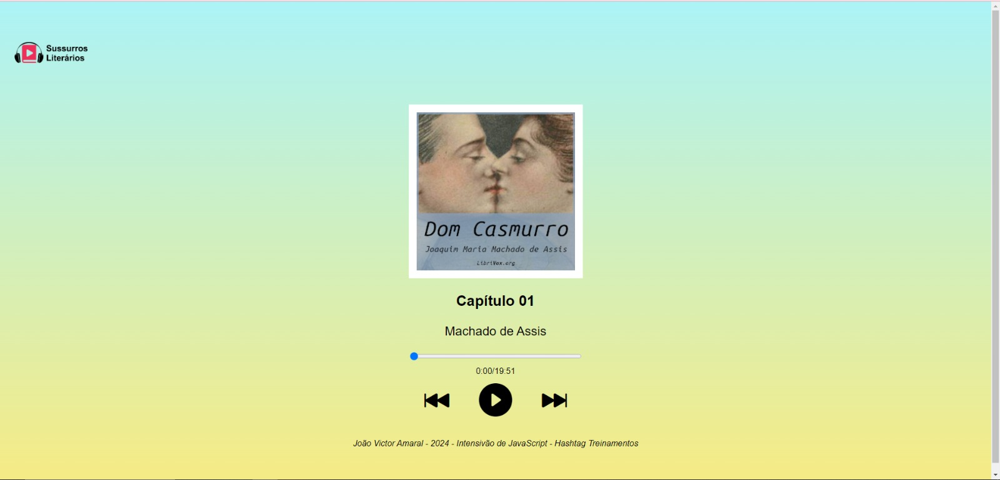

# Projeto Audiobook



## Visão Geral

Este é um projeto de audiobook criado durante o Intensivo de JavaScript da Hashtag Treinamentos. O projeto inclui elementos visuais personalizados e apresenta uma barra de progresso indicando o progresso do áudio, tempo atual e mais.

Visite o [Projeto Audiobook](https://audiobook-js.vercel.app/) para vê-lo em ação.

## Tecnologias Utilizadas

- 
- 
- 

## Como Executar Localmente

1. Clone o repositório:

   ```bash
   git clone https://github.com/seu-nome-de-usuario/audiobook-project.git
